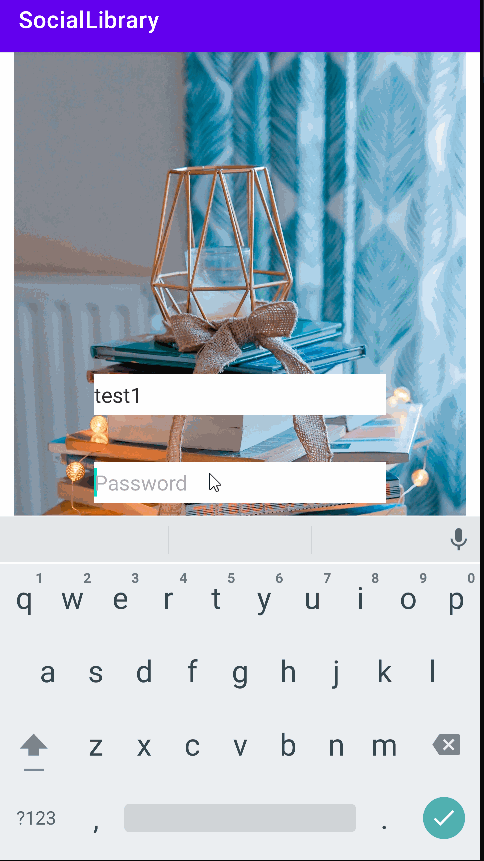
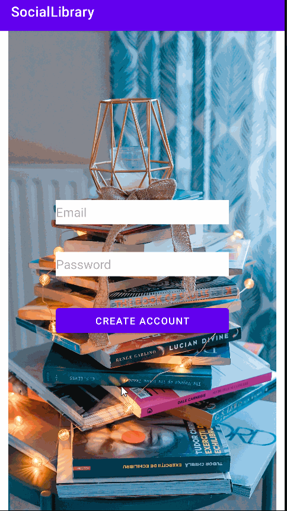

# Milestone 1 - Group 7
## Table of Contents

1. [Important Note for our Grader - Please Read!](#Note-for-our-Grader)
2. [Demo Video](#Demo-Video)
3. [Overview](#Overview)
  1. [Video Walkthrough](#Video-Walkthrough)
5. [Product Spec](#Product-Spec)
6. [Original Wireframes](#Wireframes)

## Note for our Grader
Our project board exists! It was marked as missing on the prevous milestone, but has existed from Day 1. Please find our board here.

https://github.com/orgs/Social-Lending-Library/projects/2

We were required to associate the repo with an org in the first milestone. Github has changed Project Board functionality; if a repo is associated with an org, the board is located the org level and *cannot be created* at the repo level. 

## Demo Video
https://user-images.githubusercontent.com/71856754/201435257-4fb9a5bb-1786-44a9-aff3-14e23e0682e6.mp4

### Alternate Link:
[Demo Video on Youtube](https://www.youtube.com/watch?v=OFMdhMB8BuU)

## Overview

### Video Walkthrough
Here's a walkthrough of implemented user stories:

GIF created with [LiceCap](http://www.cockos.com/licecap/)

### Description

Social Library is an app that helps users keep track of the books they are reading as well as what their friends are reading. The app's search functionality allows a user to look for a book by title and add the book to their list. User can also update their profile and add friends to their list of friends. 

### App Evaluation

[Evaluation of your app across the following attributes]
- **Category:** Social sharing
- **Mobile:** Mobile apps are convenient for any book management task, since it lets the user bring the app to their bookshelf or reading spot and potentially take pictures of their books using the camera. For a social app, the location info is particularly useful since it supports the idea of other users being nearby.
- **Story:** This app provides a nice intersection between traditional and digital media. It lets people share their favorite stories with their friends and neighbors, supports community building, and has applications to education.
- **Market:** Marketed towards readers who want to share with other readers in their community. Tangible value in the sense that users can explore new books and meet new friends. 
- **Habit:** The average user might open the app every week to check their due dates, see what new books their friends might have, or update their own collection. Users would create content by adding and sharing books, and consume it by browning other users' activity. 
- **Scope:** We reviewed several potential scopes for this app. On the basic build, a user would sign in, have the ability to create and edit their own library, add friends, and browse friend libraries. On the complex side, book borrowing could be fully implemented, users could mark books as read/have reading lists, and more social features could be added. We are working on wireframes but overall the product is fairly well-defined; we have a reasonable shared idea of how it might work.

## Product Spec

### 1. User Features (Required and Optional)

**Required Features**

- [X] Users can create an account with SocialLibrary with a username and password.
- [X] Existing users can log into their SocialLibrary account with a username and password.
- [X] Users can search for Books by title, article, or IBSN.
- [] Users can create Book Lists of books.
- [X]Users can see details of a specific Book.
- [X] Users can add and delete books to Book Lists.
- [~] Users can add or delete entire Book Lists.
- [X] Users can browse other people's profiles. 
- [X] Users can request to befriend another user.
- [~] Users can accept or deny a user's friend request.
- [~] Users can view a list of friends.
- [X] Users can view a friend's books and book lists.
- [~] Users can remove a friend from their friends list.
- [X] Users can have a small about me blurb on their profile and edit the message at any time.
- [X] Users can choose to display a 'currently reading' book.

**Stretch Features**

- [] Users can ask to borrow a book from a friend
- [] Users can track "checked out" books
- [] Users see suggested friends in People Search based on location

## Video Walkthrough

Here's a walkthrough of implemented user stories:

GIF created with [LiceCap](http://www.cockos.com/licecap/)

### 2. Screen Archetypes

- Login / Register
  - Users can create an account with SocialLibrary with a username and password.
  - Existing users can log into their SocialLibrary account with a username and password.
- My Library
  - Users can create Book Lists of books.
  - Users can add and delete books to Book Lists. 
  - Users can add or delete entire Book Lists.
  - Users can choose to display a 'currently reading' book.
- Book Search
  - Users can search for Books by title, article, or IBSN.
  - Users can add and delete books to Book Lists.
- Book Product 
  - Users can see details of a specific Book.
- People Search
  - Users can browse other people's profiles. 
- Profile (other users)
  - Users can view a friend's books and book lists.
  - Users can request to befriend another user.
- My Profile
  - Users can view a list of friends.
  - Users can choose to display a 'currently reading' book.
  - Users can have a small about me blurb on their profile and edit the message at any time.
  - Users can remove a friend from their friends list.
  - Users can accept or deny a user's friend request.
- Edit Profile
  - Users can have a small about me blurb on their profile and edit the message at any time.
### 3. Navigation

**Tab Navigation** (Tab to Screen)

* Friends
* My Library
* My Profile
* Search

**Flow Navigation** (Screen to Screen)

- Login Screen
  - => Friends Screen

- Friends Screen
  - => Friends's Profile Screen

- Friend's Profile Screen
  - => User's Library Screen

- My Library Screen
  - => View My Books list Screen
  - => Book Product Screen

- My Profile Screen
  - => Edit Profile Screen

- Edit Profile Screen
  - => Profile Screen (after saving changes to profile)

- Search Screen
  - => Book Product Screen

- Book Product Screen
  - => NONE

- Book Lists Screen
  - => Book List Screen

- Book List Screen
    - => Book Product Screen

## Mockup & Wireframes

GIFs created with [LiceCap](http://www.cockos.com/licecap/)

### [BONUS] Digital Wireframes & Mockups 
Completed - see above!

### [BONUS] Interactive Prototype
Completed - see above!
